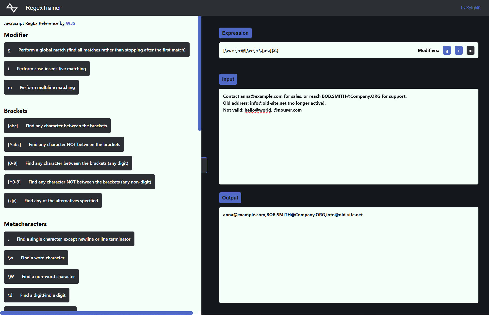

<div align="center">


# RegexTrainer

**Learn and test JavaScript regular expressions live in your browser.**


[Features](#features) · [Getting Started](#getting-started) · [Usage](#usage) · [Project Structure](#project-structure)

<br />



</div>

## About

RegexTrainer is a small playground for learning regular expressions. Type an expression, toggle modifiers and paste some text, and the matches appear as you type. A built-in reference sidebar explains the most important regex syntax, so you can look things up without leaving the page.

## Features

| | Feature | Description |
| :---: | --- | --- |
| ⚡ | **Live matching** | Every change to the expression, the modifiers or the input re-runs the match immediately. |
| 🎛️ | **Modifier toggles** | Switch the `g` (global), `i` (case-insensitive) and `m` (multiline) flags on and off with one click. |
| 📖 | **Reference sidebar** | 36 cheat-sheet entries covering modifiers, brackets, metacharacters and quantifiers, based on the [W3Schools JS RegExp reference](https://www.w3schools.com/jsref/jsref_obj_regexp.asp). |
| ↔️ | **Resizable split view** | Drag the handle between the sidebar and the editor to give either side more room. |
| ⚠️ | **Error feedback** | An invalid expression shows *Invalid Regex Expression...* instead of crashing the app. |

## Getting Started

### Prerequisites

- [Node.js](https://nodejs.org/) 16 or newer

### Installation

```bash
git clone https://github.com/Xylight0/regex_trainer.git
cd regex_trainer
npm install
```

### Run

```bash
npm start
```

The app opens at `http://localhost:3000`.

### Available Scripts

| Command | Description |
| --- | --- |
| `npm start` | Start the development server |
| `npm run build` | Build for production into `build/` |

## Usage

1. **Write an expression** in the *Expression* field without slashes, e.g. `[\w.+-]+@[\w-]+\.[a-z]{2,}`.
2. **Toggle modifiers**: active flags turn blue. Enable `g` to get every match instead of only the first.
3. **Enter text** in the *Input* field.
4. **Read the result** in the *Output* field. With `g` enabled, all matches are listed, separated by commas.

Stuck? Look up the syntax in the sidebar on the left.

## Project Structure

```text
src/
├── comp/
│   ├── LearnSection/
│   │   ├── information.json  # Regex reference content
│   │   └── List.js           # Renders the reference sidebar
│   ├── Navbar/               # Top navigation bar
│   └── RegexField/
│       ├── Expression/       # Expression input and modifier toggles
│       ├── TextInput/        # Input text area
│       └── TextOutput/       # Match results
├── context/
│   └── Regex_context.js      # Shared state (expression, input, output, modifiers)
├── images/                   # Logo
├── App.js                    # Layout and resizable split view
└── index.js                  # Entry point
```

### Extending the reference

The sidebar reads its content from [`information.json`](src/comp/LearnSection/information.json). To add an entry, put a new key and description under the matching section's `points`, or add a whole new section:


